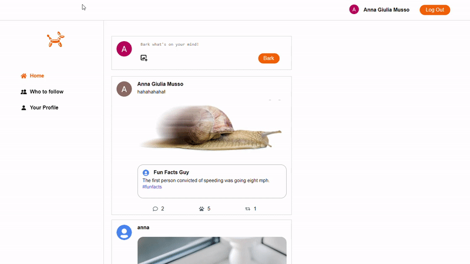

# Barker #

Barker is a Twitter inspired app. Main functionalities:
* Users can write, share, comment and like posts (called barks).
* Users can follow each other in order to see their barks.
* Users can upload and share pictures
* Each user has a profile page with information about their followers, who they are following and their activity on Barker (barks, comments and likes).
* Each post can be clicked to see details about comments, shares and likes.
* Posts can contain hashtags. By clicking on the hashtag you can display all related posts.

See live app on https://annagiuliam.github.io/barker/

This app is built with:
* Javascript
* React
* React Router (Links, Navigation)
* Backend and Login are based on Firebase

This project was very challenging and helped me solidify my knowledge of React.
I also deepened my React Router know-how and refreshed my skills with async code.
The hardest challenge was probably learning how to properly use Firebase. Luckily Firebase has a very explanatory documentation that helped me tackle the learning curve.

## Preview ##

